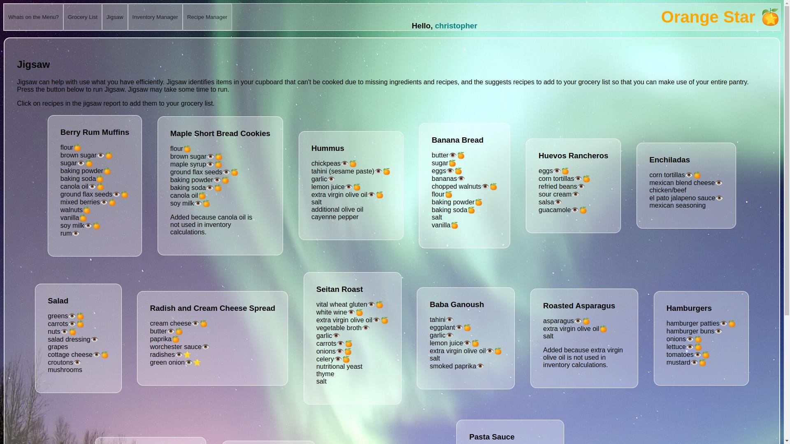

# Orange Star
*Where eating in is eating out.*

What if meal planning was as easy as ordering from a resturant menu? That's the goal of Orange Star. Choosing what to eat, making a grocery list while remembering what you already have in your pantry, and knowing what time to start dinner so it's ready at the same time are skills that can require a significant amount of planning ahead and motivation. Orange star aims to streamline and make that easier.

## Features

1. Create a visually appealing menu to help you choose what you are in the mood to cook
2. Determine what time you need to start cooking to eat at dinner time
3. Create grocery lists by choosing menu items, automatically leaving out ingredients already in your inventory.
4. Easy inventory that still works pretty well even if you half-ass it.

## Overview

Once your typical recipes are in, choose what you want to eat like choosing from from a resturant menu:

1. Make grocery lists easily by choosing what you want to eat from the menu.
2. Easily turn your grocery lists into an inventory of your pantry. 
3. Choose what you want to eat from a menu based on what's in your kitchen, and figure out what time you need to start cooking so that it will be ready at a reasonable hour. 
    
Orange Star keeps your organized. No standing in front of the fridge at 6pm, staring into your fridge and trying to figure out supper. Just order from the menu.

## Screenshots

### The Main Menu

Meal planning is just like ordering from a menu. Choose recipes from the menu and directly add the needed ingredients directly to your grocery list, then when it comes time to cook, figure out what you can cook from what you have on hand with the click of a button. You can even see what time you need to start cooking to have dinner on time. 

Edit your grocery list anywhere. Getting items into inventory is also a breeze. No scanning, entering endless quantities, or entering items one-by-one. Just click "add to inventory to move your entire grocery list to your inventory, and easily track what food you have on hand. 

The inventory manager enables to to add and remove individual ingredients to your inventory as needed. 

Jigsaw is a handy feature that allows you to make use of ingredients that don't add up to a coherent recipe. Jigsaw finds ingredients in inventory that can't currently be used to cook a recipe from your menu and suggests recipes, which allows you to pick up the needed ingredients at the grocery store so you can finally cook through everything in your pantry. 

The recipe manager tracks all of your recipes and allows you to add new recipes. The recipe manager also allows you to create new menu items too. Sick of an eating something? You can remove an item from the menu (done on the menu screen), and when you want to add it back to the menu, use the recipe manager to add it back to the menu, without ever deleting the recipe. 

### How is Orange Star different from other nutrition and meal planning apps? Why choose Orange Star?

Orange Star focuses on streamlining meal planning. The goal is to get you from choosing your food, to the grocery store, cooking, and then to stay out of the way. Your interactions with the app should be brief, "like choosing from a resturant menu". No complicated inventory. No complicated search. A few simple choices on a few simple screens.

#### Recipes Ingredients are Flexible

On your recipes, you only mark ingredients you want to compare to inventory. You don't have to make sure you have common ingredients you always have, like black pepper, tracked in inventory, and it won't get constantly automatically added to your grocery list.

#### Stupid Inventory (TM)

You don't need an accurate account of every last gram of flour in your cupboard, and you certainly don't want to enter the exact quantity of every morsel of food in your kitchen into a web app. You just need to know whether or not you have an ingredient to cook with. Orange Star keeps track of what you have in your kitchen with Stupid Inventory. You simply track whether or not an ingredient is present, which makes manually adding individual items to inventory a breeze.